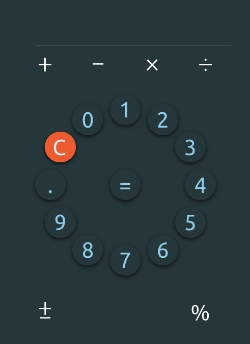

# calculator app

## Table of contents

- [Overview](#overview)
  - [The challenge](#the-challenge)
  - [Screenshot](#screenshot)
  - [Links](#links)
  - [Built with](#built-with)
- [What I've learned](#what-i-learned)

- [Author](#author)

## Overview

### The challenge

Users should be able to use calculator.

### Screenshot

### Links

- Live Site URL: [https://jolka-ef.github.io/calculator](https://jolka-ef.github.io/calculator)

### Built with

- Semantic HTML5 markup
- CSS custom properties
- Flexbox
- CSS Grid
- Mobile-first workflow
- [React](https://reactjs.org/) - JS library

## What I've learned

- using react Reducer hook
- using react Context with Reducer
- creating css responsive squares
- placing items on a circle with Css variables

## Author

yo_f
